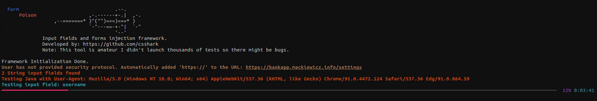

# FormPoison 📄💉
Form Input Fuzzing Framework made with Python based on my experience with data validation issues and XSS attacks executed by me.
It automates testing common missconfigurations in sanitization in input fields.
 There is also payload list (my own + AI generated and these frequently used by bounty hunters). 

## Installation:
<pre><code>git clone https://github.com/csshark/FormPoison.git
cd FormPoison
pip install -r requirements.txt </code></pre>

## Quick start 

Type <code>python3 formposion.py -h</code> for possible usage. Flags and examples of usage: 

*Tip: use some payloads manually even if they are not being executed directly on the page, they could work if they are being sent to database and displayed on different endpoints (stored XSS).* 

### Possible flags: 

  
| flag    | function |
| -------- | ------- |
| -h --help  | display help message |
| -t --threat | select threat type, possible values: HTML, Java, SQL |
| -p --payloads | select path to your custom payloads file if necessary |
| --cookies | specify user cookie ex. for testing endpoints that require authorization |
| -v --verbose | enable verbose mode, highly recommended for debugging | 
| --login | enter login+password mode only testing |
| --proxy | specify proxy for authentication | 
| --method | select request method (GET, POST, PUT, DELETE) |
| -s --seconds | delay between requests to aviod blacklisting | 

basic argument: <pre><code>python3 formposion.py yourtargetsite.org</pre></code>  
example advanced usage: <pre><code>python3 formpoison.py --cookie "JSESSIONID=9875643544376543211D32" https://www.hackthissite.org/user/login --login -t HTML -s 2</code></pre>

### payload sources:
- **payloadbox**: https://github.com/payloadbox/sql-injection-payload-list
- **varunsulakhe**: https://github.com/Varunsulakhe/HTML-INJECTOR/blob/main/html-injection-payload.txt
- **custom payloads made by me**

### Expanding payload list:
To make payloads.json more powerfull use *converter.py* to categorize and write payloads in .json format. Create *input.txt* file and store all additional payloads to convert. Remember to convert same type payloads at once, you are hardcoding category.
Example *input.txt* file format:
<pre><code>
  \<samp>XSS\</samp>
  <a href=javascript:alert('XSS')>Click\</a>
    ...and so goes on
</code></pre>

## New functions: 
<ul>
  <li>Verifying response headers precisely</li>
  <li>Ensuring payload was executed (it <b>doesn't</b> mean there is vulnerability, there are still false-positives)</li>
  <li>Specify field to test (rely on fieldname from DevTools)</li>
  <li>Cookie analysis</li>
  <li>Common web frameworks detection</li>
</ul>

InjOy! 💉
