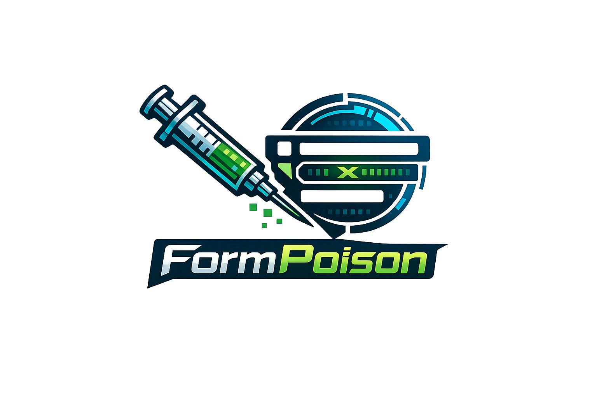

# FormPoison <div align ="center"></div><p><sub><sup><sub>Latest update: 01.06.2026, 22:30 (GMT+2)</sub></sup></sub></p>

<p align="center">
  
</p>

Smart form-focused injection framework built from practical experience with data validation flaws, XSS vulnerabilities and real-world web application testing.

The primary goal of FormPoison is to maximize XSS attack surface coverage by focusing on user-controlled forms, reflected inputs, frontend behavior and validation weaknesses. While the framework includes payloads for SQL Injection and HTML Injection testing, **XSS discovery and exploitation remains its core purpose**.

FormPoison should not be considered a replacement for tools such as Burp Suite, OWASP ZAP, XSStrike or Nuclei. Instead, it is designed to complement existing offensive security workflows and improve testing efficiency during manual assessments.

> **Before you start:** false positives may still occur. Although reflection validation and response analysis are implemented, some web applications always return `200 OK` responses regardless of input. Always manually verify findings before reporting them.

> **Disclaimer:** The author is not responsible for triggering WAFs, IDS/IPS systems, account lockouts or other security controls. Use responsibly and only against systems you are authorized to test.

---

# Why FormPoison?

Most scanners attack every parameter blindly.

FormPoison focuses on:

* Reflected XSS
* Stored XSS
* Mutation XSS (mXSS)
* HTML Injection
* CSP bypass testing
* Sanitizer bypass validation
* Frontend reconnaissance
* Form workflow analysis
* Context-aware payload filtering

Instead of throwing thousands of payloads at every field, FormPoison helps identify meaningful injection points and test them efficiently.

---

# Installation

```bash
git clone https://github.com/csshark/FormPoison.git

cd FormPoison

pip install -r requirements.txt
```

Ensure Selenium dependencies are available:

```bash
pip install webdriver-manager
```

---

# Quick Start

Before launching large injection campaigns, understand how the target behaves and familiarize yourself with available flags.

Basic usage:

```bash
python3 formpoison.py -h
```

Display all supported options.

Start testing:

```bash
python3 formpoison.py https://targetsite.com
```

Perform deeper frontend reconnaissance:

```bash
python3 formpoison.py https://targetsite.com --scan
```

Example targeted assessment:

```bash
python3 formpoison.py \
https://target.com/delivery?startQuery=1 \
--fieldname "Order Title" \
-s 4 \
--filter "iframe,onload,document.cookie" \
--verbose
```

This command:

* targets the field named `Order Title`
* delays requests by 4 seconds
* loads only matching payloads
* displays results in real time
* simplifies debugging and payload validation

---

# Recommended Pentest Workflow

## 1. Discover Forms

Run FormAtion first:

```bash
python3 formpoison.py https://target.com -qs
```

FormAtion performs lightweight form reconnaissance and suggests optimized FormPoison commands.

---

## 2. Perform Frontend Reconnaissance

Analyze:

* JavaScript files
* hidden endpoints
* forms
* suspicious values
* parameters
* potential DOM sinks

```bash
python3 formpoison.py https://target.com --scan
```

---

## 3. Test Reflections

Use filtered payloads against identified fields:

```bash
python3 formpoison.py \
https://target.com/contact \
--fieldname "Message" \
--filter "script,onerror,svg" \
--verbose
```

---

## 4. Escalate Payload Categories

Enable specialized payload collections when required:

```bash
--waf-bypass
```

```bash
--csp-bypass
```

```bash
--mXSS
```

```bash
--sanitizer-bypass
```

```bash
--encoding-confusion
```

---

## 5. Precision Testing

For complex applications:

```bash
python3 formpoison.py https://target.com --interactive
```

Inject payloads at exact positions:

```text
admin''poison'
```

or

```text
diff'poison'iculty
```

This is useful when testing:

* template rendering
* broken validation logic
* partial reflections
* context-dependent XSS
* difficult sanitizer bypasses

---

# FormAtion Module (-qs and --check flag)

FormAtion is a lightweight reconnaissance module.

Unlike `--scan`, it does not crawl JavaScript or perform source code auditing.

Instead it focuses on:

* form discovery
* response analysis
* reflection identification
* field relationship mapping

Its purpose is simple:

**Generate optimized FormPoison commands before running payloads.**

Example:

```bash
python3 formpoison.py https://target.com -qs
```

> Warning: FormAtion does not validate flag compatibility. Always verify generated commands before execution.

---

# Interactive Mode

Interactive Mode gives complete control over injection placement.

```bash
python3 formpoison.py [URL] [FLAGS] --interactive
```

When prompted, define the payload position using:

```text
'poison'
```

Examples:

```text
Field 1:
admin''poison'

Field 2:
diff'poison'iculty
```

Without the `'poison'` marker, FormPoison treats the input as static user data.

Interactive Mode supports most standard flags including:

* threat selection
* filtering
* delays
* authentication
* bypass payload categories

---

# Performance Modes

## Standard Mode

Recommended for most assessments.

```bash
python3 formpoison.py https://target.com
```

---

## Brute Mode

Maximum request throughput.

```bash
python3 formpoison.py https://target.com --brute
```

Additional tuning options:

```bash
--concurrent
--timeout
--batch-size
--batch-delay
--retries
```

> Warning: Brute Mode can overwhelm fragile targets and significantly increase the chance of triggering rate limits or security controls.

---

# Flags

<details>
<summary><b>Click to expand full flags table</b></summary>

| Flag                 | Function                         |
| -------------------- | -------------------------------- |
| -h --help            | Display help                     |
| --no-banner          | Disable banner animation         |
| -t --threat          | Select threat type               |
| --filter             | Filter payloads                  |
| --fieldname          | Target specific field            |
| --filemode           | Filename injection mode          |
| -p --payloads        | Custom payload file              |
| --cookies            | Authenticated testing            |
| -ua --user-agent     | Custom User-Agent                |
| -v --verbose         | Verbose mode                     |
| --verbose-all        | Include response body            |
| --login              | Login testing mode               |
| --mXSS               | Mutation XSS payloads            |
| --brute              | Maximum throughput mode          |
| --concurrent         | Concurrent requests              |
| --timeout            | Request timeout                  |
| --batch-size         | Requests per batch               |
| --batch-delay        | Delay between batches            |
| --retries            | Retry count                      |
| --ssl-cert           | SSL certificate                  |
| --ssl-key            | SSL key                          |
| --ssl-verify         | SSL validation                   |
| --proxy              | Proxy support                    |
| --method             | Force HTTP method                |
| -s --seconds         | Delay between requests           |
| --interactive        | Interactive injection mode       |
| -qs --check          | Quick reflection check           |
| --scan               | Frontend reconnaissance          |
| --max-urls           | Maximum URLs                     |
| --max-depth          | Crawl depth                      |
| --max-workers        | Worker threads                   |
| --auto-target        | Auto-injection from scan results |
| --waf-bypass         | WAF evasion payloads             |
| --csp-bypass         | CSP bypass payloads              |
| --sanitizer-bypass   | Sanitizer bypass payloads        |
| --encoder-bypass     | Framework/CMS payloads           |
| --encoding-confusion | Encoding confusion payloads      |
| --size-overflow      | Overflow payloads                |
| --url-param          | URL parameter analysis           |
| --url-param-name     | Specific parameter               |
| --csp-directive      | CSP directive injection          |
| --csp-value          | CSP value injection              |

</details>

---

# Example Commands

Basic:

```bash
python3 formpoison.py https://target.org
```

Authenticated assessment:

```bash
python3 formpoison.py \
https://target.org/profile \
--cookies "JSESSIONID=123456789"
```

Login workflow testing:

```bash
python3 formpoison.py \
https://target.org/login \
--login \
--verbose
```

Custom payloads:

```bash
python3 formpoison.py \
https://target.org \
-p custom_payloads.json
```

---

# Payload Sources

* PayloadBox SQL Injection Payload List
* Varun Sulakhe HTML Injector
* Custom payload collections

---

# Extending Payloads

To expand payload coverage use:

```bash
converter.py
```

Create:

```text
input.txt
```

Example:

```html
<script>alert('XSS')</script>
<a href=javascript:alert('XSS')>Click</a>
<svg onload=alert(1)>
```

Convert payloads into FormPoison-compatible JSON format.

You may also create your own payload database and use:

```bash
-p payloads.json
```

without modifying framework source code.

---

# False Positives

FormPoison includes:

* reflection validation
* response comparison
* basic false-positive reduction

However, some applications:

* always return 200 responses
* reflect input without execution
* rewrite payloads dynamically
* alter behavior through WAFs

Always manually verify findings before reporting vulnerabilities.

---

# Bugs & Issues

FormPoison is an independent community-driven project.

Not every feature receives extensive testing across all frameworks and edge cases.

If you discover:

* bugs
* bypass techniques
* framework-specific payloads
* performance improvements

please open an issue or contribute directly.

---

# Recent Improvements

* Interactive field injection
* High-speed brute mode
* Multithreaded request execution
* Login mode filtering support
* Full CSP bypass implementation
* Reflection validator improvements
* Better payload filtering logic

---

# Contributing

Contributions are welcome.

If you have ideas for:

* payload categories
* bypass techniques
* framework support
* detection improvements

feel free to open a Pull Request.

---

InjOy! 💉
